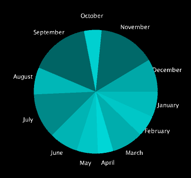

# Music Visualiser Project
## Team Members:

Name: Racheal Chen

Student Number: C22338873

Name: Zannath Min Dilruba Tasneem

Student Number: C21371071

Name: Nikita Verbitskiy

Student Number: D20123962

Name: Liutauras Bruozis

Student Number: C22506249
	
=======

# Description of the assignment
In our project we decided on the song "Slow Dancing In The Dark" by Joji. The song is poignant and introspective. It explores themes of love, heartbreak, and vulnerability. The song is characterized by its haunting melody and emotional lyrics, which resonate with listeners on a deep level.
In this assignment we have been tasked to create audio visualisers for our chosen song. We aim to create visuals that are immersive and create a captivating experience that resonates with our audience on both a visual and emotional level. we attempt to convey the melancholic beauty and introspective mood, by synchronizing the visuals with the song's rhythm and dynamics.

# Instructions
We set up 4 separate packages for each of our audio visual java files. 
We are to import them into a main audio java file ( utilising switch cases) and then run the audio java file in a main.java.
We downloaded a mp3 format of our chosen song into the data folder where our visual files will retrieve the song.


# How it works 
### Zannath 
### Liutauras Bruozis' Visual
For my audio visual processing sketch i utilized the minim audio library so that my visuals react to the music. The song that we chose for this project was “SLOW DANCING IN THE DARK” by Joji. As the music plays the draw() function essentially creates visuals that respond to the sound buffers data. 

 

Here is how the visuals work in the code: 

The sketch is designed to run in full-screen mode, using a 3D rendering engine (P3D). 

It sets up an audio player and loads the specified song. 

In the draw() loop, a semi-transparent rectangle is drawn across the screen each frame to create a fading trail effect. 

It then translates the origin to the center of the screen so that the visuals are in the middle. 

For each sample in the sound buffer, it calculates two angles based on sine functions that incorporate iterative variables n4 and n6 which create movement that increases over time. 

Using these angles, it calculates positions (x and y) on a circular path and positions (x3 and y3) on a larger, more variable circular path. 

It then draws ellipses and rectangles at these positions, with the size of these shapes being effected by the audio buffer's left and right channels. 

Colours are set to white and a semi-transparent blue and orange for different shapes. 

The iterative variables n4 and n6 are incremented slightly with each frame, creating evolving movement over time, which also speeds up and down depending on the frequency of the audio. 

### Nikita Verbitskiy's Visual
Global Variables

Minim minim; - An instance of the Minim class, which handles audio operations.

AudioPlayer ap; - Used for playing audio.

AudioBuffer ab; - Represents the audio buffer to access the sound data.

float[] lerpedBuffer; - An array to store "smoothed" (interpolated) audio data.

ArrayList<MatrixCode> matrixCodes; - An ArrayList to store instances of the MatrixCode class, which will simulate the "falling code" effect from the Matrix movie.

Setup Method (setup())
Initializes the Minim object, loads an audio file, and starts playing it.

Initializes the audio buffer to the mixed stereo output of the audio player.

Sets the color mode to HSB (Hue, Saturation, Brightness).

Initializes the lerpedBuffer array and creates multiple MatrixCode objects, each representing a column of falling characters.

Settings Method (settings())
Sets the size of the window where the visualization will be displayed.

Draw Method (draw())
Called repeatedly, creating an animation effect.

Clears the screen.
Updates and displays the MatrixCode objects.

Translates the drawing context to the center of the window.

Draws two mirrored waveforms based on the audio data, where the color of the lines is mapped to their position, creating a rainbow effect.

KeyPressed Method (keyPressed())
Toggles the audio playback when the spacebar is pressed.

MatrixCode Class
An inner class that represents each column of the falling characters effect.

Contains an ArrayList of Characters, coordinates (x and y), speed, and length.

Methods in MatrixCode
update(): Moves the column down the screen and resets it when it goes beyond the bottom edge, generating a new random set of characters.

display(): Displays the characters at their current position with varying levels of transparency (alpha) to create a fading effect.

The visualization combines an audio-reactive waveform with a Matrix-like "digital rain" effect. The waveform is drawn according to the audio data, and the Matrix code effect is achieved through the MatrixCode class. Each instance of MatrixCode simulates a stream of random characters falling at a random speed, simulating the well-known effect from the Matrix films. The visual and auditory elements together create a dynamic multimedia experience.



Creating a project that integrates audio with visual elements, especially in a way that mimics the iconic "digital rain" from the Matrix, is no small feat. It requires not only programming skills but also a creative vision to bring it all together.

### Racheal Chen's Visual
My Processing sketch creates a 3D visual representation of the music using circles that move and change size according to the audio input:

**Dynamic Circle Generation:** Circles are randomly generated around the center origin in the range of 20px of eachother. An array of circles is looped to dynamically generate the circles around the center. These circles are the main elements of the visual.

**Colours:** The changing colours of the circles are based on the low and high sounds of the audio. By using FFT, it can determine the low, mid and high sounds so the colours red, green and blue (respectivly) can be displayed. When all sounds are present, the circles turn white.
Also noting that by utilising the lerpedBuffer(), I created a seamless transition between the colours as the level of the sounds change.

**Circle Movement Speed:** The speed in which the circles move along the Z axis is determined by the volume of the music, the louder the music, the quicker the circles travel. The circles move and speed up dynamically due to the z position of the circles being constantly updated ( incremently increasing ) based on the 'intensity' of the audio. I believe this works excellent with the music, to evoke various strong emotions.

**Circle Sizing:** The size of the circles dynamically change as it travels. The size changes due to the amplitude of the audio. This creates an effect similar to a speaker's diaphram when it vibrates due to a deep bass sound.

**Overall Visualization:**
Combining these elements together creates a mesmerizing 3D visual representation of the music. As the audio plays, the circles dynamically move, change size, and shift in color, synchronized with the rhythm and intensity of the music. This immersive experience engages the viewer's senses, allowing them to both see and feel the music in a unique way. The dynamic interplay between sound and visuals enhances the emotional impact of the music, turning the listening experience into a captivating visual journey.


# What I am most proud of in the assignment
### Nikita:
My project showcases several competencies:

**Audio Processing:** Implementing audio playback and analysis using the Minim library.

**Visual Representation:** Translating audio data into a visual waveform and creating a separate visual effect inspired by a cultural reference.

**Programming Logic:** Using loops, conditionals, and class structures effectively.

**Creative Coding:** Applying code to an artistic endeavor, which is a unique challenge that combines technical skill with aesthetic sense.

**Successful Audio Integration:** Implementing the Minim library to handle audio, and not just playing back a track but accessing its waveform data, is a technical achievement.

**Learning and Applying a New Library:** Understanding and utilizing a new library like Minim can be challenging. Getting to grips with its features and functions is something to be proud of.

**Creating the Matrix Effect:** The Matrix "digital rain" is iconic and recreating that visually through code demonstrates not only my programming skills but also my problem-solving abilities.

**Algorithm Development for Visual Effects:** Designing the algorithms that control the falling characters' speed, randomness, and resetting mechanism requires careful thought and experimentation.

**Synchronizing Audio with Visuals:** I’ve managed to create a visual representation of the audio data by mapping the audio buffer to a waveform display. The fact that i mirrored the waveform to create a symmetrical visual effect shows an attention to detail and an artistic touch.

**Code Organization and Structure:** Writing clean, organized code with a well-thought-out class structure for the MatrixCode shows my ability to architect software that is maintainable and scalable.

**Overcoming Challenges:** Any bugs or challenges i faced and overcame during the development are moments of learning and growth.

**Creative Expression:** Bringing together audio and visual elements in a way that expresses a creative idea is fulfilling on both a technical and artistic level.

### Zannath:

### Liutauras:
The fact that I used audio data to drive visual changes in my project making it respond to the frequency of the audio and tempo creates a very aesthetic visual. 

The blending of colours and shapes through the use of transparency adds a layer of complexity to the visuals. 

Incrementing angles over time for a dynamic and evolving visual patterns. From this project I have broadened my knowledge and understanding of motion and change within visual systems. 

The fact that I've set up an environment that responds in real-time to music is an achievement in itself, tying visual aesthetics to audio input is a significant accomplishment. 

 

Overall I am very happy with how my visual looks aesthetically and how it responds to the audio. When designing my visual I wanted to go for something that would look like fireworks as i believe that it would make a very nice and creative visual. When it comes to how it ties in with the song, the artist talks about getting over someone and letting them go. I personally think that great, beautiful moments happen just as fast as they disappear, like fireworks which shine so bright and fade away into the darkness just as fast, reminding us that nothing lasts forever not even darkness. I’m happy that I did the audio visual as my project as it helped me become better and more accustomed to using  java and experimenting with audio. This was a great experience which helped me develop as a programmer.

### Racheal:
In this assignment, I'm really proud of how I could express my creative vision through my 3D music visualization in Processing.

**Creative Concept:** I came up with the idea of using circles to represent the music visually, and I'm thrilled with how it turned out. The shape is simple yet its smoothness creates an element of softness. The shape compliments the music throughout due to the song's melancholic aspect, however, during the song's climax, the softness of the circle battles against the harsh sounds and volume. It's amazing to see how this captures the essence of the music in a visually engaging way.

**Technical Implementation:** I put a lot of effort into implementing various technical features, like dynamic circle generation and color mapping based on audio frequencies. I was influenced by various online audio visuals and I reviewed many of their codes and managed to implement great features into my own project. I'm really happy with how these elements contribute to the overall beauty and coherence of the visualization.

**Aesthetic Design:** I paid close attention to the visual aesthetic, focusing on details like color transitions and circle movement dynamics. I'm proud of how I utilized online resources, like tutorials and forums, to learn new techniques and refine my design skills. This allowed me to create a visually stunning and polished result.

**Emotional Impact:** By syncing the visual elements with the music's rhythm and intensity, I've created an experience that evokes strong emotions and enhances the listener's engagement with the music. It's rewarding to know that my work can connect with others on such a deep level.

Overall, I'm proud of how I combined creativity, technical skill, and the ability to search and utilize online resources effectively to create a compelling and immersive visualization of music. This assignment truly showcases my passion for both art and technology. This project was definitely rewarding in the end to be able to see and showcase our work.

# Markdown Tutorial

This is *emphasis*

This is a bulleted list

- Item
- Item

This is a numbered list

1. Item
1. Item

This is a [hyperlink](http://bryanduggan.org)

# Headings
## Headings
#### Headings
##### Headings

This is code:

```Java
public void render()
{
	ui.noFill();
	ui.stroke(255);
	ui.rect(x, y, width, height);
	ui.textAlign(PApplet.CENTER, PApplet.CENTER);
	ui.text(text, x + width * 0.5f, y + height * 0.5f);
}
```

So is this without specifying the language:

```
public void render()
{
	ui.noFill();
	ui.stroke(255);
	ui.rect(x, y, width, height);
	ui.textAlign(PApplet.CENTER, PApplet.CENTER);
	ui.text(text, x + width * 0.5f, y + height * 0.5f);
}
```

This is an image using a relative URL:



This is an image using an absolute URL:


This is a youtube video:

[](https://youtu.be/elcjsvxjdNU?si=ZoUzmWbLGURCHdhf)
<iframe width="899" height="584" src="https://www.youtube.com/embed/elcjsvxjdNU" title="OOP MUSICVISUAL2024 Project" frameborder="0" allow="accelerometer; autoplay; clipboard-write; encrypted-media; gyroscope; picture-in-picture; web-share" referrerpolicy="strict-origin-when-cross-origin" allowfullscreen></iframe>

This is a table:

| Heading 1 | Heading 2 |
|-----------|-----------|
|Some stuff | Some more stuff in this column |
|Some stuff | Some more stuff in this column |
|Some stuff | Some more stuff in this column |
|Some stuff | Some more stuff in this column |

## NOTES

- Remember to create your own branch to work on the project to prevent interference with others or the master branch
https://thenewstack.io/dont-mess-with-the-master-working-with-branches-in-git-and-github/
>>>>>>> 7556433eaf5818b08c4d0bbc1c6dab6fc9c78a57
- To add the repo files onto your system : go to bash/terminal and type in 
```
git clone https://github.com/C22338873/OOP-MusicVisual-2024
```
- To commit and push updated file 
```
git add .
git commit -m "updated something"
git push
```
- To run example code : go to Main.java and replace 'RotatingAudioBands' in the line below with the file you wish to run
```
processing.core.PApplet.runSketch(a, new RotatingAudioBands());
``` 
- Then in vsc terminal type (for Mac)
```
cd java
source mcompile.sh
source mrun.sh
```
- compile and run on windows
```
cd java
source compile.sh
source run.sh
```

